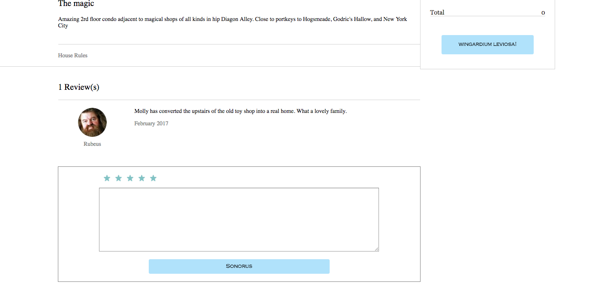

#Wander
[heroku link][heroku]
[heroku]: https://wand-er.herokuapp.com/#/

Wander is a home sharing website inspired by Airbnb set in the magical world of Harry Potter. It is built using Ruby on Rails on the backend, a PostgresSQL database, and React/Redux framework on the frontend.

##Features and Implementation

###Dwellings

On the backend, dwellings are stored in the database with columns for id, owner_id, location, price, image_url, about_this, description, guest_limit, bedrooms, beds, and house_rules.

Dwelling index items are rendered in /home in the dwelling index within the search component.  Each item displays the image, location, and price and links to the dwelling show page.
The dwelling component renders all information about the dwelling and reviews.

####Dwelling Component

###Dwelling search

There is an active search bar on /home that allows for search by maximum price and location.  The dwellings will responsively match selected filter.

####Search Component

###Bookings

Logged in users can book dwellings for specific dates and number of guests by making bookings which are stored in the database. Bookings have columns for user_id, dwelling_id, guest_number, start_date, and end_date. Dwellings restrict their availability based on associated bookings.
Bookings are rendered in /bookings and filtered for the logged in user who can view and cancel their bookings.

####Bookings index

###Reviews

Logged in users can leave reviews for dwellings. Reviews are stored in the database with a user_id, dwelling_id, body, and rating.
Reviews are rendered in the reviews component within the associated dwelling component.

####Reviews

###Dwelling creation
Logged in users can create new dwelling listings under the "Become a Host" button on the navbar.  The dwelling creation form includes
input fields for all information rendered in the dwelling component, including image upload.

